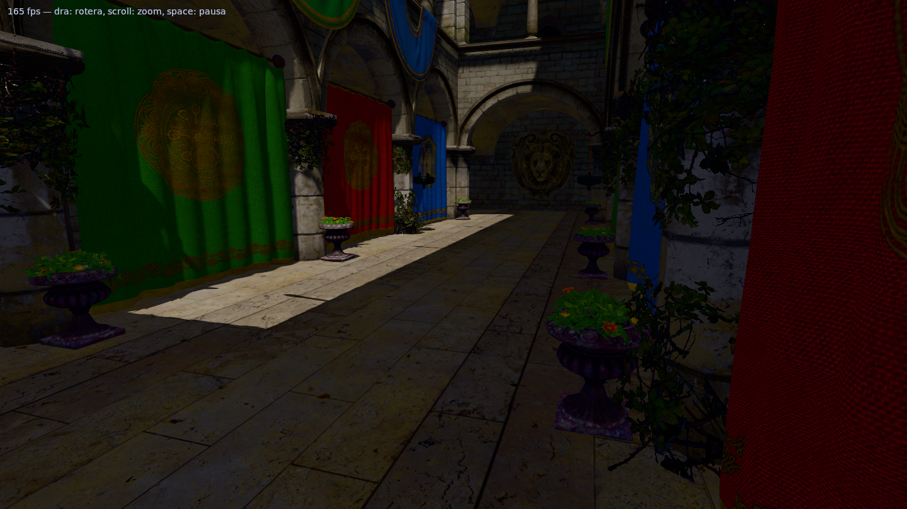
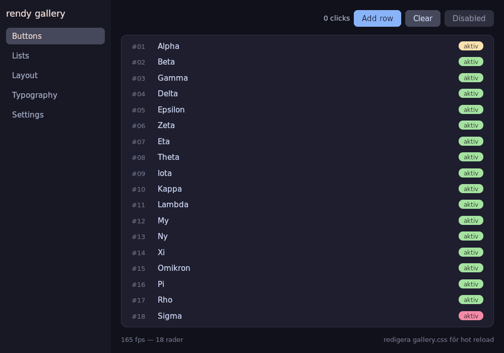
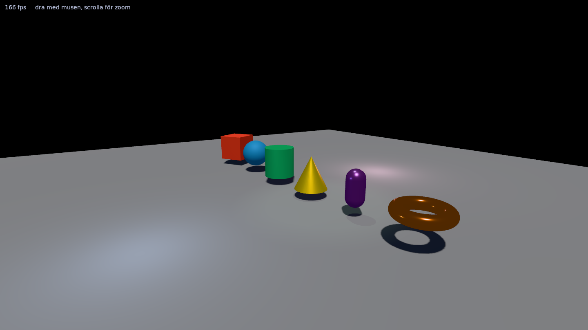
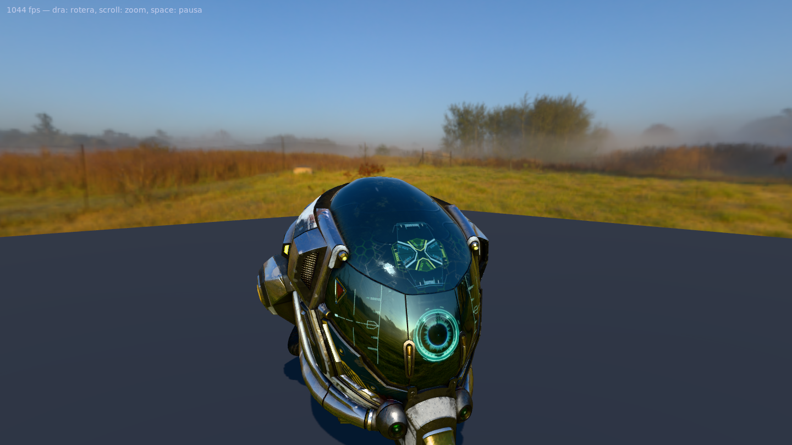

# rendy

[](https://github.com/bonises/rendy/actions/workflows/ci.yml)

A C++20 rendering library built on Vulkan 1.3 — fast 2D UI with real CSS
(flexbox, hot reload), forward-rendered PBR 3D with lights and shadows, glTF
model loading, text, and audio. For games, editors, and anything in between.

| | |
|---|---|
|  |  |
|  |  |

*Sponza with cascaded sun shadows, PBR and alpha-masked foliage — ~1200 fps
at 1440×810 on an RTX 3090 (release build, vsync off).*

```cpp
#include <rendy/rendy.hpp>
using namespace rendy;

int main() {
    auto app = App::create({.title = "hello", .size = {1280, 720}}).value();
    while (app.pollEvents()) {
        auto frame = app.beginFrame({.clear = colors::slate});
        frame.canvas().drawRect({{100, 100}, {200, 120}},
                                {.color = 0xE74C3CFF_rgba, .cornerRadius = 12});
        frame.canvas().drawText("hej världen", {120, 260}, {.size = 24});
        frame.present();
    }
}
```

## Features

- **2D**: batched immediate-mode canvas (rects, images, text) — the whole UI
  is typically a single draw call. Rounded corners, borders and anti-aliasing
  via SDF; clipping without batch breaks.
- **UI + CSS**: retained element tree styled with a real CSS subset —
  flexbox (Yoga), `width`/`height`, padding/margin, `:hover`, hot reload of
  `.css` files — plus an equivalent typed C++ styling API.
- **Text**: HarfBuzz shaping (ligatures, kerning, Arabic and other complex
  scripts) with full bidi (UAX#9 via SheenBidi), over a FreeType glyph
  atlas tuned for editor-crisp UI text.
- **3D**: clustered forward+ PBR (metallic-roughness, ~1000 lights),
  directional/point/spot lights,
  cascaded + cube shadow maps, HDRI skybox + image-based lighting, MSAA,
  HDR + tonemapping, transparency, all basic primitives, glTF 2.0 loading
  with skeletal animation (fastgltf).
- **Audio**: WAV/OGG playback with a simple mixer (SDL3).
- **Performance first**: Vulkan 1.3 dynamic rendering, bindless textures,
  per-frame linear allocators, two frames in flight.

## Building

Requires: Linux with a Vulkan 1.3 driver, CMake ≥ 3.28, GCC 11+/Clang 14+.
All other dependencies are fetched and pinned automatically.

```sh
cmake --preset release
cmake --build --preset release
./build/release/examples/01_hello/01_hello
```

Run the test suite (CPU-only, no GPU needed) with `ctest --preset release`.
Install with `cmake --install build/release --prefix <dir>` — you get a
self-contained `librendy.a` (all dependencies bundled), headers, and a
`find_package(rendy CONFIG)` package.
CI builds every push with GCC and Clang across the `debug`, `release` and
`asan` presets with warnings-as-errors
([workflow](.github/workflows/ci.yml)).

## Documentation

- [Getting started](docs/getting-started.md)
- Guides: [2D & Canvas](docs/guides/2d-canvas.md) · [UI & CSS](docs/guides/ui-css.md) ·
  [3D](docs/guides/3d.md) · [Audio](docs/guides/audio.md)
- [API reference](docs/api/)
- [Internals](docs/internals/) — architecture notes for contributors

## Examples

| | |
|---|---|
| `01_hello` | window, rounded box, text |
| `02_ui_gallery` | flexbox layouts, lists, hover states, live CSS reload |
| `03_text_editor_lite` | small but real text editor (typing, save) |
| `04_scene3d` | primitives, moving lights, cascaded shadows |
| `05_model_viewer` | glTF viewer with orbit camera |
| `06_breakout` | mini-game: 3D + CSS HUD + sound |
| `07_audio` | mixer playground |

## License

MIT
